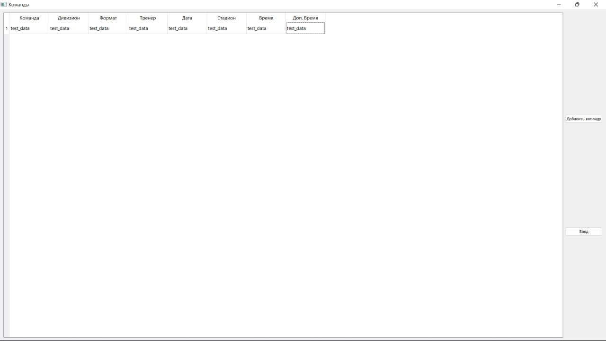
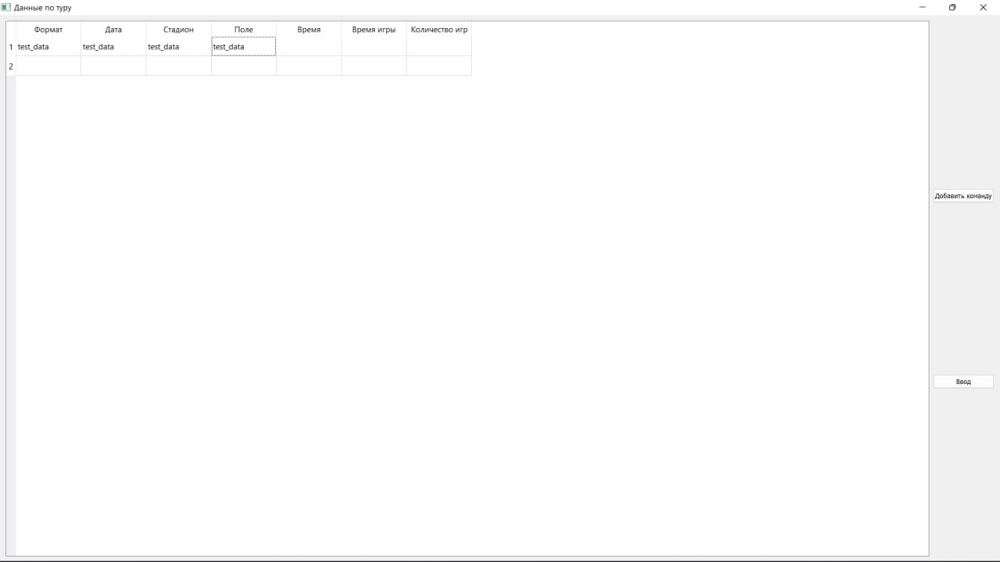

# Scheduling football matches

Windows Application to create schedule for football matches based on teams preferences and stadiums parameters 

## Requirements

1) PyQt5 == 5.15.2    
2) openpyxl == 3.1.2    
3) sqlalchemy == 2.0.16  
4) loguru == 0.6.0

## Building

### Setup python project
Clone this repo in your work directory and install dependencies
```console
git clone https://gitlab.com/todo-lr/football.git
pip install -r requirements.txt
```

### Build to executable file
For building to **.exe** file required python lib `auto-py-to-exe` of version `2.35.0` (linked in `requrements.txt`)
1. Run auto-py-to-exe in terminal:
    ```console
    auto-py-to-exe
    ```

1. Set parameters. The most important are:
    * Onefile - data will be packed in single file;
    * Console Window - hide terminal while running
    * Icon - set icon
    * Settings/Output Directory - path to executable file
    * Advanced/name - name of executable file


   

3. Press **CONVERT .PY TO .EXE**

## Run

### As python file
Move to local repository and run ```main.py```
```console
cd Path/To/Repo/football 
python -m main
```

### As executable file
Move to chosen build path run assembled **.exe** file
```console
Path/To/Assembled/File.exe
```

## Usage
At first, you should fill commands preferences such as:
   * Command name
   * Division name
   * Game formant **(amount of players in team 3...11)**
   * Name of coach
   * Date of game **(in format dd-mm-yyyy)**
   * Stadium name
   * Time preference **(in format hh:mm)**
   * Additional time preference


Next 


